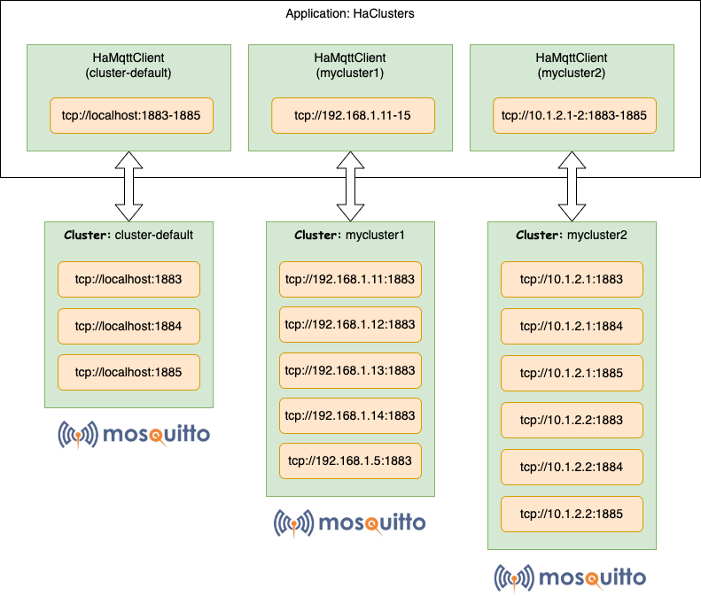
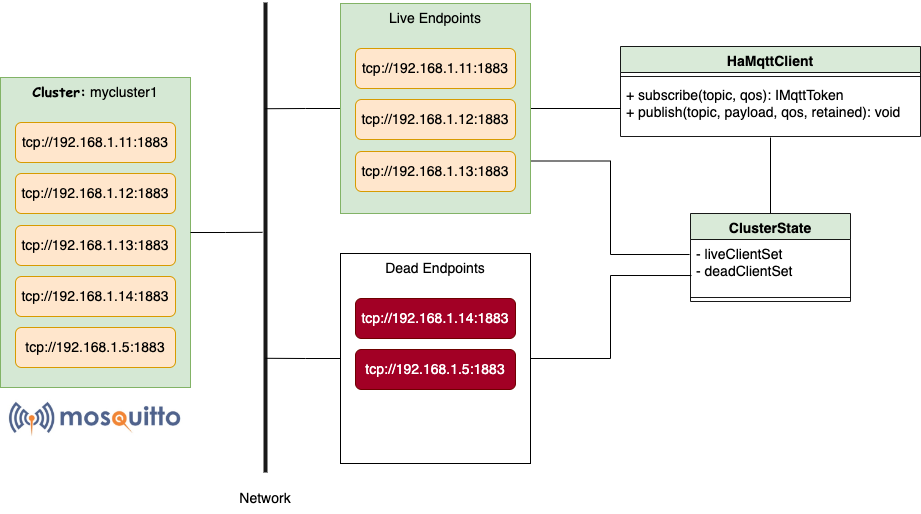
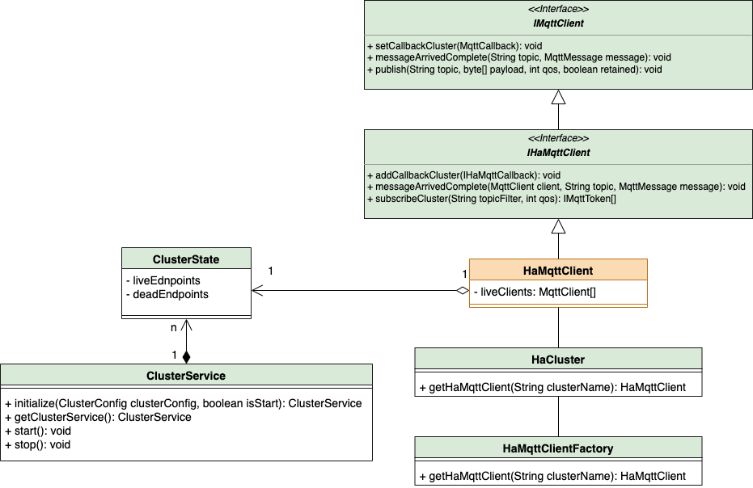

# MQTT Addon Library

This package contains the PadoGrid MQTT API for clustering edge devices with IMDG products.

## Compiling and installing mqtt-addon-core

```
mvn install
```

## Deploying mqtt-addon-core

Place the `mqtt-addon_core-<version>.jar` file in the application class path. Upon successful build, the jar file can be found in the target directory as follows:

```
target/mqtt-addon-core-<version>.jar
```

## Terminology

- The terms *broker*, *server*, and *endpoint* are interchangably used in this document.
- The term *application* represents a JVM instance that may have one or more clusters configured.
- The term *cluster* represents a group of one or more endpoints configured by the application.
- The term *cluster client* is an `HaMqttClient` instance assigned to a particular cluster.
- The term *broker client* represents an `MqttClient` instance that is connected to a single broker.

## Addon Features

### Clustering MQTT Brokers

There are numerous commercial MQTT products that offer clustering solutions, but if you are on a tight budget then you might consider implementing your own clustering solution. Depending on the clustering flexibility that you want in your system, clustering MQTT brokers can get complicated. If you are primarily in need of High Availability (HA), then instead of clustering from the server side, you can implement a simple client-side API to attain the same level of HA that commercial products offer. Such an API undoubtedly comes with some limitations but because of the instability nature of edge devices, the limitations maybe tolerable for many use cases. With this reasoning, PadoGrid provides a client API, `HaMqttClient`, for clustering MQTT brokers. 



### `HaMqttClient` Design

`HaMqttClient` wraps [Paho's `MqttClient`](https://www.eclipse.org/paho/index.php?page=clients/java/index.php) and provides support for multiple broker connections. It can be configured with a configuration file or via API. An application can create one or more instances of `HaMqttClient`, each forming a cluster. A cluster is initially defined by listing the server URIs which can be modified during runtime, effectively providing support for dynamic scalability. By default, `HaMqttClient` attempts to connect to all of the URIs when it is first instantiated. It places the successfully connected URIs in the live broker client list and the failed URIs in the dead broker client list. During the course of `HaMqttClient` life, if a live broker client fails, then it is automatically moved from the live broker client list to the dead broker client list such that the application always works with live brokers. To revive the dead brokers, behind the scene, a dedicated daemon thread periodically probes and attempts to connect to the dead brokers, moving successfully connected broker clients from the dead broker client list to the live broker client list. The revival activities are independently carried out and completely hidden from `HaMqttClient`. They do not negatively impact the `HaMqttClient` performance in any way. Rather, they increase the overall `HaMqttClient` performance by taking away the connectivity chores and load balancing only with the live brokers.



For topic publications, `HaMqttClient` publishes messages using only one of the broker clients, ensuring the delivery of non-duplicate messages to the cluster. For topic subscriptions, `HaMqttClient` subscribes to all of the live brokers. Even though subscriptions are made to all brokers, since only one broker client publishes a given message, only one broker will deliver that message. The application can receive messages in the form of Paho's `MqttCallback` or PadoGrid's `IHaMqttClientCallback`. While `MqttCallback` only receives messages, `IHaMqttClientCallback` also includes the Paho's `MqttClient` instance that is responsible for receiving messages. `IHaMqttClientCallback` is useful for lifting [`HaMqttClient` Limitations](#hamqttclient-limitations) described below.


### `HaMqttClient` QoS (Quality of Service)

`HaMqttClient` maintains the same level of QoS as the underlying MQTT client API (Paho). The only difference is that there are multiple MQTT client instances under the hood, each maintaining the same QoS for a given topic. For publishing to topics, `HaMqttClient` publishes to only one of the brokers. For subscribing to topics, on the otherhand, `HaMqttClient` subscribes to all of the brokers. This fanout pattern effectively provides a load balancing service and gurantees the delivery of non-duplicate messages. Furthermore, since QoS is independently maintained by each broker, `HaMqttClient` also maintains the same level of QoS provided by individual brokers. 

### `HaMqttClient` Limitations

#### Multiple retained messages

Since `HaMqttClient` subscribes to multiple brokers, it receives the retained messages from all of them. `HaMqttClient` does not determine which message is the lastest retained message and treats all brokers as standalone servers. This limitation can be lifted by using one of the following methods.

1. **Create a sticky cluster with the primary broker defined.** A sticky cluster sticks to one broker for all subscriptions. By sticking to one broker, it blocks the delivery of messages from other brokers in the cluster. If we use the primary broker for the sticky broker, then the applications will always receive the last retained messages from that broker. A sticky cluster requires bridged brokers supported by the underlying MQTT product. Bridged brokers are capable of forwarding messages from broker to broker. For example, Mostquitto supports bridged brokers, but unfortunately, as of writing (v2.0.15), the use of bridged brokers is thwarted by a bug that delivers cyclic (looping) messages endlessly back to the originated broker.

2. **Create a cluster with a single endpoint (server URI).** This essentially disables HA but guarantees one retained message per topic per `HaMqttClient` instance. To offload the single endpoint, you can create additional clusters for the topics that do not require retained messages.

3. The previous workaround, of course, defeats the purpose of `HaMqttClient`. If you need to keep HA intact, then you can include a timestamp as part of the payload and determine the latest retained message based on the latest timestamp. This workaround assumes that the publishers are synchronized with the network clock that properly handles time drift.

4. For edge devices scattered everywhere, however, it might be impossible to synchronize them with the network clock. In that case, depending on data consistency requirements, the application can designate one broker for providing all retained messages. If that broker fails then the application selects the next reliable one from the endpoint list. This approach is not for all applications but those that weigh more on receiving data in a consistent manner and can tolerate a small window of retained data inconsistency.

## Using `HaMqttClient`

`HaMqttClient` has the same API as Paho's `MqttClient`. It implements `IHaMqttClient` which extends `IMqttClient`. `IHaMqttClient` also contains additional methods that are specific to `HaMqttClient`. This allows you to easily and seamlessly migrate to `HaMqttClient` from `MqttClient`, and vice versa.

Unlike `MqttClient`, you cannot directly instantiate `HaMqttClient`. You must use `HaCluster` to create an `HaMqttClient` instance. Once you have an `HaMqttClient` instance, you use it just like `MqttClient`. All the methods provided by `MqttClient` are also available from `HaMqttClient`. If you want to be able to quickly switch between `HaMqttClient` and `MqttClient`, then you can restrict from using the `IHaMqttClient` methods. However, we encourage you to try out the additional methods which can greatly ease your cluster chores.



### Migration: `HaMqttClient` vs `MqttClient`

Migration between `HaMattClient` and `MqttClient` can be done with a single line of code. There are a couple of ways to achieve this.

#### `IMqttClient`

The simplest way is to typecast `IMqttClient` as follows.

```java
IMqttClient client  = (IMqttClient)HaCluster.getHaMqttClient();
```

✏️  There is one caveat to this approach, however. The method, `IMqttClient.messageArrivedComplete(int messageId, int qos)`, is supported only if the cluster has one (1) endpoint. If the cluster is configured with more than one (1) endpoint, then it throws `UnsupportedOperationException`. This is because, with `IMqttClient` alone, there is no way to determine which server in the cluster to direct this call. Remember, an `HaMqttClient` instance represents multiple servers. If you must use this method then you would need to use `HaMqttClient` as described in the next section.

#### `HaMqttClient`

It turns out `MqttClient` that implements `IMqttClient` includes some methods that are not part of `IMqttClient`. If you are using these methods then you need `HaMqttClient`.

```java
HaMqttClient haclient = HaCluster.getHaMqttClient();
```

✏️  The method, `HaMqttClient.messageArrivedComplete(MqttClient client, int messageId, int qos)`, is a counterpart of `IMqttClient.messageArrivedComplete(int message Id, int qos)`. As described in the preivous section, the latter method is not supported for a cluster with more than one (1) endpoint. The former method addresses this limitation, which requires the additional argument, `client`, but it is not as useful since you can also directly invoke the `messageArrivedComplete()` method using `client`. It is merely there for API completeness. You would normally invoke `client.messageArrivedComplete(int message Id, int qos)` from a callback as shown in the following example. *Note that unlike `MqttClient` which supports only one callback, `HaMqttClient` supports multiple callbacks.*

```java
HaMqttClient haclient = HaCluster.getHaMqttClient();
client.addCallbackCluster(new new HaMqttCallback() {
   ...
   public void messageArrived(MqttClient client, String topic, MqttMessage message) throws Exception {
      ...
      client.messageArrivedComplete(message Id, qos)
  }
  ...
});
haclient.connect();
```

### Callbacks

In addition to `IMqttClient.setCallback()`, `HaMqttClient` supports `IHaMqttClient.addCallbackCluster()` as shown below.

#### `HaMqttClient`

```java
HaMqttClient client = HaCluster.getHaMqttClient();
client.addCallbackCluster(new new HaMqttCallback() {
   ...
});
client.setCallback(new new MqttCallback() {
   ...
});
client.connect();
```

#### `MqttClient`

```java
MqttClient client  = new MqttClient();
client.setCallback(new new MqttCallback() {
   ...
});
client.connect();
```

## Configuring `HaMqttClient`

`HaMqttClient` can be configured using the API or an YAML file. Configuring `HaMqttClient` with an YAML file is preferred. It eliminates the complexity and rigidity of coding, and provides the portablity and simplicity of namespace-based clustering. The following shows an example YAML file.

```yaml
enabled: true
defaultCluster: cluster-default
probeDelay: 5000

# Define persistence class that persists messages for QoS 1 and 2.
persistence:
  className: MqttDefaultFilePersistence
  properties:
    - key: path
      value: persist

clusters:
  - name: cluster-default
    publisherType: ROUND_ROBIN
    connection:
      serverURIs: [tcp://localhost:1883-1885]
  - name: mycluster
    publisherType: STICKY
    connection:
      serverURIs: [tcp://localhost:32001-32010]
```

You can configure your application to host **multiple clusters** in the configuration file, each with a a unique cluster name assigned. In your application, you would invoke `HaCluster.getOrCreateHaMqttClient(String clusterName)` to get the `HaMqttClient` instance that has been configured with the specified cluster name.

- To get the default cluster client (The default cluster has the name "cluster-default"):

  ```java
  // Both return the default cluster client instance.
  HaMqttClient client = HaCluster.getHaMqttClient();
  HaMqttClient client = HaCluster.getOrCreateHaMqttClient("cluster-default");
  ```

✏️  You can also specify your own default cluster and cluster name using the `defaultCluster` attribute.

- To get a non-default cluster client:

  ```java
  HaMqttClient client = HaCluster.getHaMqttClient("mycluster");
  ```

  If the cluster name is defined in the configuration file then the `HaMqttClient` will form the cluster based on the cluster definition in the configuration file. If it is not found, then it uses the default settings.

### Configuration File

The configuration file is searched in the following order.

1. API, i.e., `HaCluster.getOrCreateHaMqttClient(ClusterConfig.Cluster clusterConfig)`.
2. File path defined by the system property, `org.mqtt.addon.client.cluster.config.file`.
3. In class path, `mqttv5-client.yaml`.

System properties and environment variables are supported for string attributes in the configuration file. 

- A system property is denoted by `${my.system.property}`
- An environment variable is denoed by `${env:MY_ENV_VAR}`, `env` must be in lowercase and no spaces are allowed before or after `:`. 
- Only one of each type per attribute is allowed, i.e., one system property, one environment variable, or both.

The default YAML configuration file is found in the following link.

[Default YAML File](src/main/resources/mqttv5-client.yaml)


## Logging

`HaMqttClient` uses two (2) logging frameworks, `log4j2` and `java.util.logging`, as follows.

- `HaMqttClient` uses `log4j2`. The default `log4j2` file is `etc/log4j2.properties`.
- `MqttClient` uses `java.util.logging`. An example Paho logging configuration file is provided: `etc/paho-logging.properties`.

✏️  As a reference, please see the `perf_test` app, which includes both configuration files.

## Apps

- `perf_test` - PadoGrid includes the popular `perf_test` app that uses `HaMqttClient`. Please see [MQTT `perf_test` App](../padogrid-deployment/src/main/resources/mqtt/apps/perf_test/README.md) for details.


