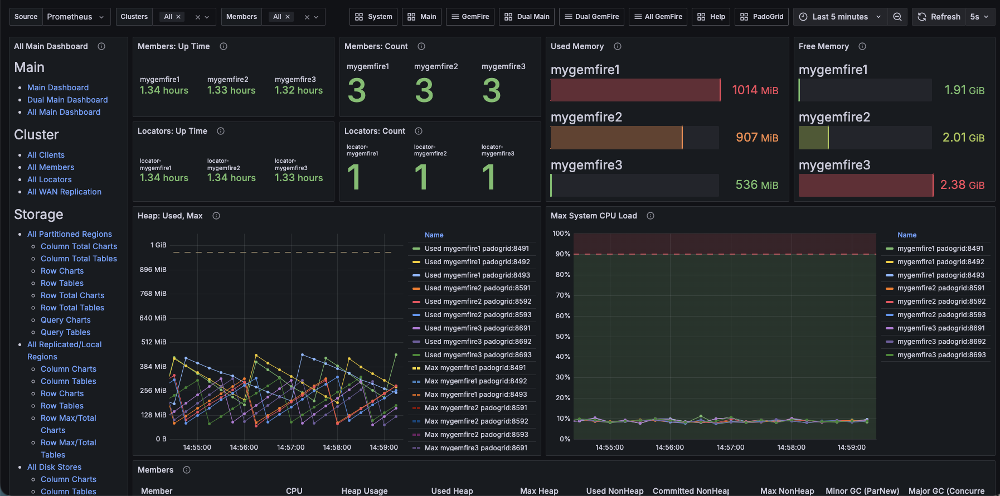

 [*PadoGrid*](https://github.com/padogrid) | [*Catalogs*](https://github.com/padogrid/catalog-bundles/blob/master/all-catalog.md) | [*Manual*](https://github.com/padogrid/padogrid/wiki) | [*FAQ*](https://github.com/padogrid/padogrid/wiki/faq) | [*Releases*](https://github.com/padogrid/padogrid/releases) | [*Templates*](https://github.com/padogrid/padogrid/wiki/Using-Bundle-Templates) | [*Pods*](https://github.com/padogrid/padogrid/wiki/Understanding-Padogrid-Pods) | [*Kubernetes*](https://github.com/padogrid/padogrid/wiki/Kubernetes) | [*Docker*](https://github.com/padogrid/padogrid/wiki/Docker) | [*Apps*](https://github.com/padogrid/padogrid/wiki/Apps) | [*Quick Start*](https://github.com/padogrid/padogrid/wiki/Quick-Start)

---

# My Workspace

---

*This markdown file serves as your workspace document. Replace the content below with your workspace descriptions and remove the `images` directory.*

---

# [PadoGrid](https://github.com/padogrid)

PadoGrid is a collection of add-on components and tools specifically designed for [data grid products](https://github.com/padogrid#data-grid-products) to deliver out-of-the-box, shrink-wrapped solutions. It introduces the concept of *distributed workspaces* for creating DevOps environments in which use cases can be quickly developed, tested, deployed and shared.

## [Distributed Workspaces](https://github.com/padogrid/padogrid/wiki/Workspace-Lifecycle-Management)

A workspace provides a sandbox environment completely isolated from other workspaces and can host a wide range of software components from a simple app to a highly complex ecosystem with many data grid clusters, apps, VMs, and Docker/Kubernetes containers. You can, for example, create a workspace that federates multiple data grid clusters serving inventory and sales data, a workspace that streams database CDC records via Kafka, a workspace that handles streamed data into the federated clusters via one or more Apache Spark or Hazelcast Jet clusters, and yet another workspace that integrates data analytics tools for performing AI/ML operations and creating reports. PadoGrid consolidates your workspaces into a single operations center.

## [Bundles](https://github.com/padogrid/catalog-bundles/blob/master/all-catalog.md)

A workspace snapshot can be taken at any time in the form of a bundle that can be quickly deployed and run on another workspace created by another user on another platform. Because of their portability, bundles provide the means to shrink-wrap fully operational use cases. PadoGrid includes bundle catalogs from which you can search your use cases.

There are many online bundles that are readily available for you to deploy in your workspaces. These bundles are use case oriented as they range from simple tutorials to very complex enterprise ecosystems with many endpoints. See the [online catalogs](https://github.com/padogrid/catalog-bundles/blob/master/all-catalog.md) for details. To list all the public online bundles, run the `show_bundle` command as follows.

 `show_bundle -all -header`

## [Dashboards](https://hub.docker.com/repository/docker/padogrid/padogrid-grafana/general)

PadoGrid includes Grafana dashboards for monitoring GemFire and Hazelcast. These customizable dashboards complement the GemFire Management Console and Hazelcast Management Center with a series of cluster-wide and individual member views providing comprehensive system health and data movement details that are not found in those products.

## [JupyterLab](https://github.com/padogrid/padogrid/wiki/JupyterLab)

PadoGrid natively integrates JupyterLab to bring the server-side tasks to the browser, enabling end users such as data scientists to take control over distributed computing products such as datagrids and stream-processing platforms. PadoGrid achieves this by conjugating PadoGrid and Jupyter workspaces to form *workspace dashboards*.

PadoGrid automatically creates a JupyterLab dashboard for the current workspace. If you have JupyterLab installed, then try running `start_jupyter`.

 `start_jupyter -dashboard`

## [Visual Studio Code](https://github.com/padogrid/padogrid/wiki/VS-Code)

PadoGrid and VS Code go hand-in-hand as they both organize the user environment in the form of workspaces. As with JupyterLab, PadoGrid tightly integrates VS Code workspaces providing developers a complete control of PadoGrid's distributed workspaces with a single command, `open_vscode`.

 `open_vscode`

## [Using PadoGrid](https://github.com/padogrid/padogrid/wiki)

PadoGrid provides a unified set of commands to drive popular data grid products such as *GemFire*, *Geode*, *Hazelcast*, *Jet*, *Redis*, *SnappyData*, *Coherence*, *Kafka*, *Confluent*, *MQTT*, *Hadoop*, *Spark*, etc. along with monitoring tools such as *Promtheus* and *Grafana*, and integrated support for IDEs such as *JupyterLab* and *Visual Code*. The `padogrid` man page or the `padogrid -?` command provides a complete list of commands.

<head>

</head>

    

       
    

    

    <pre>
man padogrid
padogrid -?
</pre>
    

## [PadoGrid Tutorial](https://github.com/padogrid/bundle-none-tutorial-padogrid)

To get familiar with PadoGrid, try the PadoGrid tutorial bundle. It provides step-by-step instructions to help you quickly get hands-on with PadoGrid.

 `install_bundle -download -workspace tutorial-padogrid bundle-none-tutorial-padogrid`

Upon installation, follow the instructions in the workspace's `README.md` file. Try the tutorial with JupyterLab.

    

       
    

    

    <pre>
switch_workspace tutorial-padogrid
start_jupyter -dashboard &
show_jupyter
</pre>
    

## References

1. PadoGrid Tutorial Bundle, https://github.com/padogrid/bundle-none-tutorial-padogrid

---

 [*PadoGrid*](https://github.com/padogrid) | [*Catalogs*](https://github.com/padogrid/catalog-bundles/blob/master/all-catalog.md) | [*Manual*](https://github.com/padogrid/padogrid/wiki) | [*FAQ*](https://github.com/padogrid/padogrid/wiki/faq) | [*Releases*](https://github.com/padogrid/padogrid/releases) | [*Templates*](https://github.com/padogrid/padogrid/wiki/Using-Bundle-Templates) | [*Pods*](https://github.com/padogrid/padogrid/wiki/Understanding-Padogrid-Pods) | [*Kubernetes*](https://github.com/padogrid/padogrid/wiki/Kubernetes) | [*Docker*](https://github.com/padogrid/padogrid/wiki/Docker) | [*Apps*](https://github.com/padogrid/padogrid/wiki/Apps) | [*Quick Start*](https://github.com/padogrid/padogrid/wiki/Quick-Start)
