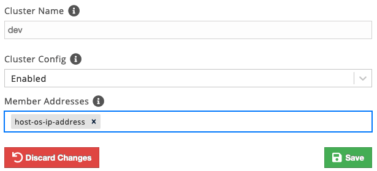

# Hazelcast Docker Compose

This article describes how to create a Docker environment and launch a Hazelcast cluster using `docker compose`.

:exclamation: You must first install Docker and Docker Compose. See [References](#references) for download links.

## Switch to Hazelcast Cluster

Make sure you switch into the correct the correct Hazelcast cluster (IMDG or Jet) before creating a Docker cluster. The `create_docker` command applies the current cluster settings to the Docker Compose files.

```bash
# Create and switch into an IMDG cluster if you want to create a Docker cluster for IMDG.
make_cluster -product hazelcast -cluster myhz 
switch_cluster myhz

# Create and switch into a Jet cluster if you want to create a Docker cluster for Jet.
make_cluster -product jet -cluster myjet
switch_cluster myjet
```

## Create PadoGrid Docker Cluster

Once you are switched into the cluster that is configured for the desired product (IMDG or Jet) as described in the previouse section, run the `create_cluster` command which creates a Docker cluster that is specific to that product.

```console
# Create Hazelcast cluster with 2 members (default)
create_docker -cluster mydocker
```

By default, the create_docker command adds two (2) Hazelcast servers (members) in the cluster. You can change the number of servers using the `-count` option. For example, the following command adds four (4) servers.

```console
# Create Hazelcast cluster with 4 members
create_docker -cluster mydocker -count 4
```

## Configure the Cluster Environment

```console
cd_docker mydocker
```

Edit the `.env` file as needed.

```console
vi .env
```

There are three (3) Hazelcast configuration files as follows. Edit them as needed.

| Configuration File                         | Cluster Type |
| ------------------------------------------ | ------------ |
| `padogrid/etc/hazelcast.xml`               | IMDG, Jet    |
| `padogrid/etc/hazelcast-jet.xml`           | Jet          |
| `padogrid/etc/hazelcast-client.xml`        | Jet          |

:exclamation:By default, the cluster name is hard-coded in the `padogrid/etc/hazelcast.xml` file as `dev`, even though the Docker cluster name is `mydocker` in our example. If you want to keep the Hazelcast cluster name same as the Docker cluster name then uncomment the `padogrid.cluster-name` system property in the `padogrid/etc/hazelcast.xml` file.

:exclamation: For Jet Management Center, the cluster member addresses are listed in the `padogrid/etc/hazelcast-client.xml` file using the `HOSTNAME_FOR_CLIENTS` value set in the `.env` file. If you change the value of `HOSTNAME_FOR_CLIENTS` then you must also make the same changes in the `padogrid/etc/hazelcast-client.xml` file.

```console
vi padogrid/hazelcast.xml
```

Place your application jar files in the `padogrid/plugins` directory, which already contains PadoGrid test jar for running `perf_test`. 

```console
ls padogrid/plugins
```

## Start Cluster

```console
docker compose up
```

## Management Center

Management Center URLs are as follows:

| URL                                       | Cluster Type |
| ----------------------------------------- | ------------ |
| http://localhost:8080/hazelcast-mancenter | IMDG         |
| http://localhost:8081                     | Jet          |

:exclamation: If you have not changed the Hazelcast cluster name, then keep in mind that the Hazelcast cluster name is set to `dev` by default as mentioned earlier. When you add a cluster config in Hazelcast Management Center 4.x, you must set the member addresses with the host OS IP address or host name, and not `localhost`.




## Log Files

The log files are generated in the `padogrid/log` directory. The following example tails the first member's log file.

```bash
cd_docker mydocker
tail -f padogrid/log/mydocker-server1.log
```

## Run `perf_test`

If you have not changed the Hazelcast cluster name, you can run `perf_test` as is without modifications.

```console
create_app
cd_app perf_test; cd bin_sh
./test_ingestion -run
```
 
If you have changed the Hazelcast cluster name, then add the `<cluster-name>` element in the `etc/hazelcast-client.xml` file as follows:

```xml
<hazelcast...>
...
   <cluster-name>mydocker</cluster-name>
...
</hazelcast>
```

## Teardown

Ctrl-C from the `docker compose up` command and prune the containers.

```console
docker compose down
docker container prune
```

## Tips

1. If you get the **"No space left on device"** error when you start `docker compose`, run the following to free up the disk space.

```bash
docker system prune --volumes
````

## References
1. Install Docker, [https://docs.docker.com/install/](https://docs.docker.com/install/).
2. Install Docker Compose, Docker Compose is now part of the `docker` command. Before installing `docker-compose`, check to see if this option exists, [https://docs.docker.com/compose/install/](https://docs.docker.com/compose/install/). 
